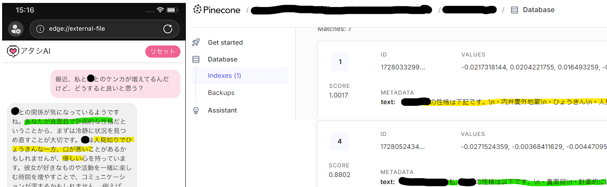

# 「1Dayインターンシップ用おまけ課題」リポジトリ
300行くらいのHTMLファイル1つで、こういうものを作ります。

## 初めに
本リポジトリには、「2026年卒の学生向けの1Dayインターンシップ」に参加した方向けに、  
作者が個人的に作成した「少し高度なおまけ課題用のHTMLファイル」を格納しています。  
公式な課題ではなく、インターンシップ後の個人的な時間を利用して実施してもらうことを想定しています。

この課題を作成した目的は下記です。
- 生成AIに対する理解度を更に高めてもらうこと
- 生成AIを利用したシステムを作る際の難しさの一端を体感してもらうこと

最終的な成果物は、下記理由から就活時に面接官にアピールできる材料にもなるでしょう。
- webと生成AIという訴求力の高い技術を組み込んだものを、スマホでサッと見せることが可能
- 生成AIへの企業の関心は高い一方、知見を持つエンジニアはまだ多くないので、人材として希少性がある

## 注意事項
このリポジトリには、課題用のコードのみ格納しています。  
実際に課題を進めるには下記が必要になりますが、インターンシップの価値を維持するため、このリポジトリ内では扱いません。  
- 1Dayインターンシップで学ぶ「HTML/CSS/JavaScriptの基礎的な知識と技術」
- 1Dayインターンシップで学ぶ「ChatGPTをシステムに組み込むための基礎的な知識と技術」
- 1Dayインターンシップで配布している「本おまけ課題を進めるための解説ドキュメント」
  
何かの縁でここに辿りついて、[1Dayインターンシップに興味を持った方はこちらをご覧ください](https://job.mynavi.jp/26/pc/corpinfo/displayInternship/index?optNo=-C7Wa&corpId=66889)。  
参加をお待ちしています。

## 連絡方法
[GitHubディスカッション](https://github.com/Toms-Ito/SimpleRAG/discussions)からお願いします。  
ただし、趣味的に作ったものなので、返信にはとても時間がかかると思ってください。。。

## 課題の内容と独自性
シンプルなRAGシステム（Retriever-Augmented Generation）を構築します。  
RAGは、生成AIに未知の情報を取り入れて回答させる手法で、  
今後の主流になると期待されている有力なアプローチです。  
  
今回の課題ではそのための中核となる技術として、  
生成AIにはChatGPTを、ベクトルデータベースにはPineconeを使用します。  
    
通常、このようなシステムを作成するためには、  
プログラムを実行させるためのサーバー環境（Node.js等）を用意するのが一般的ですが、  
この課題で作成する最終的なシステムは ***300行程度のHTMLファイル1つで完結する*** 点に独自性があります。  
  
この特徴はセキュリティリスク（不注意によるAPIキー流出）が高まる一方で、下記メリットがあります。
- 使用技術の種類を限界(？)まで減らせる。具体的には、HTML/CSS/JavaScript のみ。それだけでも本当に使えるシステムが作れる
- 上記の知識/技術は、某社の1Dayインターンシップで学ぶ内容であるので、参加学生であれば、スムーズに課題を進めることができる
- それにより「生成AIを利用したシステム作成に必要となる本質的な知識/技術」をコスパよく得ることができる
  
学生向けの課題としては、意義のあるアプローチだと考えています。
